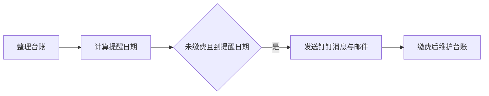

# 用一张表设置专利年费自动提醒

企业有几十项专利，每项专利的缴费时间又不一样，怎样才能及时提醒负责人？

不少企业已经有一份专利缴费 Excel，里面记录着专利名称、申请号、缴费日期和金额。日常管理时，需要定期打开表格，看看哪些费用快到期了，再通知相关人员处理。

最近，我们尝试把这样一份台账接入钉钉，配置了一套云端提醒流程：**按台账中的缴费日提前30天，于上午9点发送邮件和钉钉消息。**

流程保存在云端，不需要自己的电脑一直开机，也不需要搭建服务器。邮件和钉钉消息均已完成收发测试。

这套方法怎样搭建？下面分享几个关键步骤。

## 第一步：先整理现有台账

将已有 Excel 导入钉钉 AI 表格前，先核对几个基本字段：

| 字段 | 作用 |
| --- | --- |
| 专利名称、申请号 | 确认是哪一项专利 |
| 缴费日 | 确定提醒所依据的日期 |
| 年费名称、金额 | 便于核对本期费用 |
| 缴费状态 | 区分未缴费、已缴费、待核对 |
| 接收邮箱 | 确定邮件接收人 |

这里有一个容易忽略的问题：**“已授权”不等于“已缴费”。**

如果原表只有“已授权”等备注，没有本期缴费状态，就需要先确认哪些费用尚未缴纳。缺少缴费日期的记录可以继续保留在台账中，待核对后再纳入提醒。

同样，表里的“缴费日”究竟是核对后的缴费期限，还是企业内部的计划付款日，也应先明确。提醒系统会按照填写的日期运行，日期本身需要事先核准。

## 第二步：增加两个自动计算字段

除了原有信息，我们增加了“提醒日期”和“距离下一次缴费剩余天数”两列。

计算逻辑很简单：

**提醒日期＝缴费日－提前天数**

**剩余天数＝缴费日－当天日期**

例如，某项费用计划于11月30日缴纳，选择提前30天提醒，提醒日期就是10月31日。如果当天是10月1日，剩余天数则显示60天。

在本次使用的钉钉 AI 表格中，可以通过公式字段实现计算。例如，提前30天的提醒日期公式为：

`IF(ISBLANK([缴费日]),"",DATEADD([缴费日],-30,"days"))`

剩余天数公式为：

`IF(ISBLANK([缴费日]),"",DAYS([缴费日],TODAY()))`

这些公式会让未填写缴费日的记录保持空白。保存后，应选几条记录核对结果。

需要注意，**Excel 导入后的计算结果可能只是固定值**。要让日期在云端持续计算，应在钉钉表格中设置公式字段。

## 第三步：设置提醒触发条件

进入表格的自动化功能，配置一条流程：

1. 到达记录中的“提醒日期”时触发。
2. 发送时间设为上午9点，并确认时区。
3. 筛选条件设为“缴费状态等于未缴费”。
4. 执行发送钉钉消息和发送邮件两个动作。

这样，每条记录都可以按照自己的提醒日期触发通知。提前天数也可以根据企业实际安排选择，比如7天、15天或30天。

如果界面没有所需的快捷选项，就先用公式算出准确的提醒日期，再设置当天触发。**提前30天与提前一个月并不总是同一天。**

## 第四步：配置邮件和钉钉收件人

本次配置使用了 QQ 邮箱发送邮件，并向指定人员发送钉钉消息。

邮件中可以说明提醒规则，附上台账入口；钉钉消息可以设置明确的标题，以及“查看缴费台账”按钮，方便负责人打开查看。

使用邮箱连接器时，应按页面要求完成账号配置。邮箱授权码直接填写在服务页面，不要放进台账、聊天记录或公开截图。

不同账号、版本和连接器的可用功能可能不同，搭建前应确认自己的账号是否提供相应发送动作，并查看自动化运行额度。钉钉 AI 表格官网：[https://table.dingtalk.com/](https://table.dingtalk.com/)

## 第五步：先测试，再发布

此前用虚构记录测试的是提前7天的流程；正式使用时改为按缴费日提前30天计算提醒日期。测试记录只能证明测试阶段的执行结果。

配置完成后，建议先用几条明确标记的虚构记录测试：

- 未缴费记录能否触发提醒；
- 已缴费记录能否被筛选排除；
- 邮件和钉钉消息是否分别收到；
- 通知中的台账链接能否正常打开。

验证时也要区分两件事：手动测试成功，说明发送流程可以执行；到了设定时间自动触发成功，才说明定时规则也经过验证。

测试结束后，恢复正式时间和数据，检查流程是否已经发布、处于运行状态。

## 最后，别忘了维护缴费后的状态

自动提醒能减少人工翻表的次数，台账仍然需要及时维护。

完成缴费后，将本期状态更新为“已缴费”；下一年度的缴费日期和金额确认后，再录入新的缴费安排。没有确定的日期，不应直接沿用上一年度的数据。

另外，一次导入并不代表本地 Excel 与云端表格已经自动同步。采用这套方法后，最好明确由谁维护云端台账，避免两个版本逐渐出现差异。

对于已经有专利缴费 Excel、又希望提前收到通知的企业，这是一种可以从现有资料起步的方法：整理台账、计算提醒日期、配置发送规则，再通过测试确认流程有效，让负责人有更充足的时间安排核对、审批和缴费。

## 将本方法用于 Codex

本仓库根目录的 [SKILL.md](SKILL.md) 是可复用的 Codex Skill，`references/` 保存台账与钉钉操作细节，`scripts/audit_patent_ledger.py` 只读核对 Excel。把整个仓库放在 Codex 的个人 skills 目录后，可以通过 `$dingtalk-patent-fee-reminders` 调用。

